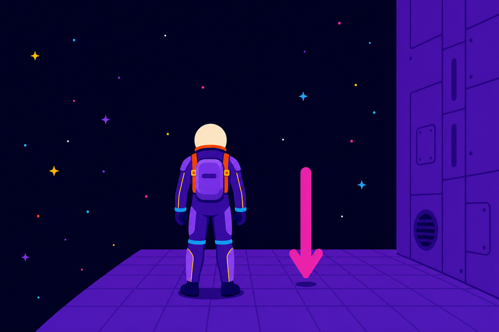
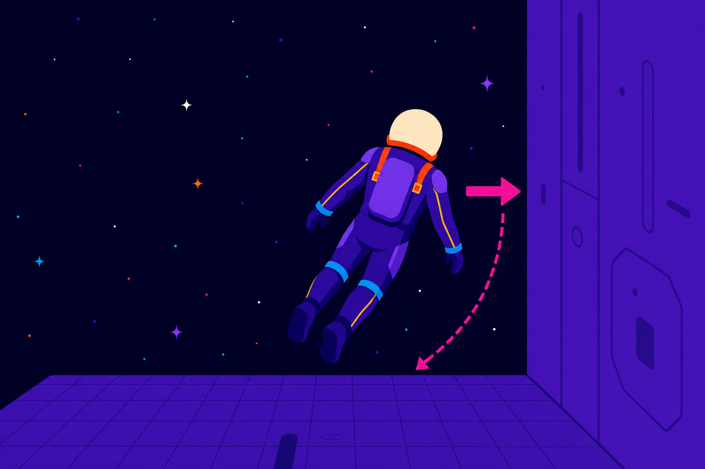
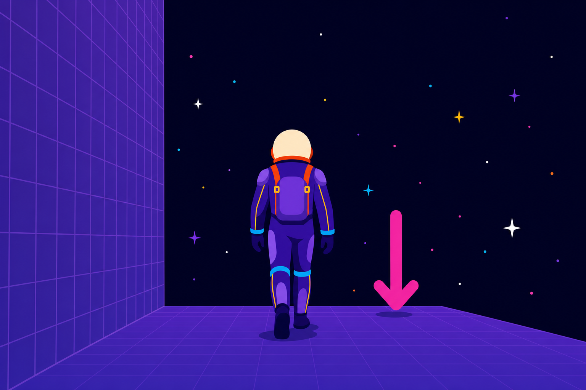

# UE5 Custom Gravity in 100% Blueprints — Part 1
### Bite-size tutorial · storyboard · "why it works" · Kurzgesagt-style smooth-3D motion graphics

> **Rewrite goals**
> 1. **Teach the model first, the clicks second** — every concept gets a *why* before any node is placed.
> 2. **Bite-size chunks + checkpoints** — the video is split into many small modules, and each ends in a
>    ✅ **CHECKPOINT** (a testable state). A viewer can't drift past a broken build, which kills the
>    "followed blindly, then it broke" problem.
> 3. **Signature motion graphics** — concept beats are stylized inserts: *Kurzgesagt-inspired, rendered in
>    smooth 3D with flat vector-look shading* (see Appendix A). Flagship is the 30s "Three Axes" piece; the rest are short stingers.

**Format key**
- 🎬 **SCREEN** — what's on screen / screen-record direction
- 🎙️ **VO** — narration (tightened, in your voice)
- 🅣 **ON-SCREEN** — text overlay
- 💡 **WHY** — the mental model (say it out loud)
- ⚠️ **MISS-RISK** — the step people skip that breaks everything
- ✅ **CHECKPOINT** — "press play, you should see X" gate before the next chunk
- 🎨 **MOGRAPH** — a stylized smooth-3D insert (not a screencast)
- 🎞️ **STORYBOARD** — a reference frame in `../Assets/storyboard/`

---

## 📑 YouTube Chapters (paste into the description)
*Timestamps aligned to the current cut — nudge after re-recording.*

```
0:00  Walking on walls (the goal)
0:12  Why every tutorial says "use C++"
1:04  Chunk 1 — Duplicate the character
1:17  Chunk 2 — The gravity toggle (press G)
1:40  Why the camera breaks
1:53  💡 A camera needs THREE axes
2:34  Chunk 3 — Pivot 1: gravity / up
2:48  Chunk 4 — Pivot 2: left-right (yaw)
3:08  Chunk 5 — Pivot 3: up-down (pitch)
3:21  Chunk 6 — Mount the camera
3:25  Chunk 7 — Look input: turning
3:50  ⚠️ Spring-arm settings (don't skip)
4:18  Chunk 8 — Look input: pitch
4:48  Why W walks the wrong way
5:20  Chunk 9 — Fix: Absolute Rotation
5:52  Chunk 10 — Move from the camera
6:51  Why pressing G breaks it again
7:20  Chunk 11 — Make Rotation From Axes
9:00  Chunk 12 — Cleanup & guard rails
9:54  Chunk 13 — Clamp look limits
10:20 ⚠️ Chunk 14 — Anim fix: Vector Length
10:56 Recap & Part 2 tease
```

---

# ACT 0 — THE PROMISE

## Cold open — walking on walls · ~0:00–0:12
🎬 **SCREEN:** Finished demo. Walk on floor → press **G** → gravity snaps to **−Y**, now walking on the wall, mouse-look + WASD perfect. Quick lap.

🎙️ **VO:**
> "This character is walking on the wall — no C++ anywhere, just Blueprints. And the difference here: you won't just learn *where* to click. You'll understand *why* every piece exists, so when it breaks, you'll know how to fix it. I've split this into small chunks — finish each one, hit play, confirm it works, then move on."

🅣 `CUSTOM GRAVITY — 100% BLUEPRINTS` → `Part 1: Character & Camera`

### 🎞️ Storyboard — the cold open beat

> ⚠️ **These frames are NOT the footage.** The cold open on screen is a **live
> screen recording of the finished UE5 demo** — Manny, in-engine, real gameplay
> (that is what 🎬 **SCREEN** means above). These stylized frames exist to plan
> that shot, not to replace it.

Use them for **two** things:
1. **Shot list while recording** — camera height, framing, and the three moments
   to make sure the capture actually contains.
2. **Style reference for the 🎨 MOGRAPH inserts**, which is where the violet
   astronaut actually appears on screen.

Third-person from behind, matching the in-game camera so the planned composition
and the real capture line up. These frames carry the **approved brand mascot**
(cream helmet, orange-red rim, violet suit).

> **Known issue in frame 2:** the dashed motion arc reads ambiguously — its
> arrowhead sits at the bottom, which can scan as *sideways → down* rather than
> *down → sideways*. The animation defines the true direction, so this does not
> block the edit, but do not copy the arc's arrowhead placement literally.

| 1 · Standing on the floor | 2 · Gravity flips | 3 · Walking on the wall |
|:--:|:--:|:--:|
|  |  |  |
| Gravity is `(0, 0, −1)`. Everything is ordinary — establish "normal" before breaking it. | **Press G.** Gravity rotates to `(0, −1, 0)`. The dashed arc is the whole idea: gravity is a *vector being rotated*, not a teleport. | Gravity is `(0, −1, 0)` and the camera has rotated with him, so **he** is upright and the *world* turned. |

> **Note for the edit:** frames 1 and 3 are almost the same composition — and that
> is the point. From the character's own frame of reference nothing changed; the
> world rotated around him. A still can't sell that, so **frame 2 does the work**:
> hold on the rotation long enough for the arc to register, and let the camera
> visibly travel with him rather than cutting.


## Why every tutorial says "use C++" · ~0:12–1:04
🎬 **SCREEN:** UE **Custom Gravity (5.4)** docs, the C++ community tutorial (credit "Pro"), a flash of Visual Studio.
🎙️ **VO:**
> "Almost every tutorial points to C++ — the official page is great *if* you're comfortable installing Visual Studio, generating the project and compiling. Pro's video too. I wanted the same result in Blueprints only. You can — here it is."
🅣 `Requires: C++ ❌  Visual Studio ❌  Compiling ❌`

---

# ACT 1 — GRAVITY

## Chunk 1 — Duplicate the character · ~1:04–1:17
🎬 **SCREEN:** Duplicate `BP_ThirdPersonCharacter` → rename **`BP_GravityCharacter`**. Open it.
🎙️ **VO:** "Duplicate the third-person character, give it a clear name, open it up."
✅ **CHECKPOINT:** You have a new character blueprint open. Nothing should look different yet.

## Chunk 2 — The gravity toggle · ~1:17–1:40
🎬 **SCREEN:** **Set Gravity Direction** → right-click pin → **Split Struct Pin** → **Y = −1**. Fire from **debug key G**. Compile. Game Mode → **Default Pawn Class = BP_GravityCharacter**. Play → press **G** → gravity flips, camera stays on old down.
🎙️ **VO:** "Set Gravity Direction, split the pin, Y to minus one — down now points along minus-Y. Fire it off the G key. Then set this as the Default Pawn Class. Play, press G… gravity flips. But the camera didn't."

⚠️ **MISS-RISK #1 — Default Pawn Class.** Forget this and you're still playing the old character; *nothing* here shows up. Hold on the Game Mode dropdown 2s.

🎞️ **Storyboard ref:** [frame 2 — gravity flips](../Assets/storyboard/02-gravity-flips.png). Same moment, except here the camera does *not* follow — that is the bug this chunk deliberately creates.

🎨 **MOGRAPH (stinger, ~8s): "Gravity is a vector, not a rotation."** A smooth-shaded astronaut on a slab; a red arrow labeled `(0, −1, 0)` swings from pointing down to pointing sideways; the slab's "down" follows, but a little camera icon stays stubbornly upright. Caption: *"Gravity moved. The camera didn't."*

✅ **CHECKPOINT:** Press G — the character sticks to the wall's pull, but the camera is clearly wrong. That wrongness is the whole problem we now solve.

---

# ACT 2 — THE CAMERA RIG (the heart)

## 💡 A camera needs THREE axes · ~1:53–2:34
🎬 **MOGRAPH (flagship, ~30s):** the **"Why Three Axes to Aim a Camera"** piece (full beat sheet in Appendix B).
🎙️ **VO (over it):**
> "Here's what nobody explains. Aiming a camera in 3D isn't one number — it's a *frame*: three axes. Up, right, forward. Give me only 'up' and the camera can still spin freely; 'up' alone doesn't decide where you face. A second axis locks left-right, a third gives up-down. Three axes, one orientation. So our rig gets exactly three pivots — each owning one axis."
🅣 `1 pivot · 1 axis · 1 job`
💡 **WHY:** Land this and the next three chunks feel inevitable, not arbitrary. Nobody misparents an arrow when they know what it's *for*.

## Chunk 3 — Pivot 1: gravity / up · ~2:34–2:48
🎬 **SCREEN:** Add Arrow **`Cam_Pivot_Gravity`** (root of the chain), color **white**. This owns **UP**.
🎙️ **VO:** "First arrow — Cam Pivot Gravity. It aligns our 'up' to gravity, so it's the parent of the whole rig."
✅ **CHECKPOINT:** One white arrow on the character, parented at the top.

## Chunk 4 — Pivot 2: left-right / yaw · ~2:48–3:08
🎬 **SCREEN:** Add **`Cam_Pivot_LR`** as **child** of Gravity, color **blue**. Owns **YAW** (spins on Z).
🎙️ **VO:** "Blue Cam Pivot LR, a child of the first — this is left-right, yaw around Z. Blue because that's its axis."
✅ **CHECKPOINT:** Blue arrow nested under the white one.

## Chunk 5 — Pivot 3: up-down / pitch · ~3:08–3:21
🎬 **SCREEN:** Add **`Cam_Pivot_UD`** as **child** of LR, color **green**. Owns **PITCH**.
🎙️ **VO:** "Green Cam Pivot UD, child of LR — up and down, pitch."

⚠️ **MISS-RISK #2 — parenting order.** Gravity → LR → UD, each a child of the one above. Siblings won't compose; camera goes random. Show the component tree.
💡 **WHY:** A parent→child chain means each rotation happens in its parent's clean local space — align first, then yaw inside that, then pitch inside that. That's why nesting works and three loose rotations fight each other.
✅ **CHECKPOINT:** Three nested arrows: white → blue → green.

## Chunk 6 — Mount the camera · ~3:21–3:25
🎬 **SCREEN:** Add **Spring Arm + Camera** under `Cam_Pivot_UD`; **zero the translation**.
✅ **CHECKPOINT:** Camera hangs off the bottom of the chain, pivoting cleanly.

---

# ACT 3 — LOOK

## Chunk 7 — Look input: turning (yaw) · ~3:25–3:50
🎬 **SCREEN:** `Cam_Pivot_LR` → **Add Relative Rotation** → split pin → **Look X → Z**.
🎙️ **VO:** "Cam Pivot LR gets Add Relative Rotation; feed the look's X into Z. That's our turn."

## ⚠️ Spring-arm settings — do NOT skip · ~3:50–4:18
🎬 **SCREEN:** On the boom: **Inherit Pitch / Yaw / Roll = ON**, **Use Pawn Control Rotation = OFF**. Pause on the checkboxes.
⚠️ **MISS-RISK #3 — the silent killer.** Leave Use Pawn Control Rotation on and the default system fights your pivots; the rig looks broken for no visible reason.
💡 **WHY:** "Inherit" = obey *your* pivots. "Pawn Control Rotation off" = stop obeying the built-in rotation that assumes +Z is up. You're handing camera authority to your rig.
✅ **CHECKPOINT:** Play — looking left/right works.

## Chunk 8 — Look input: pitch · ~4:18–4:48
🎬 **SCREEN:** `Cam_Pivot_UD` via a **Sequence** node → **Look Y → pitch**, **× −1** to invert (preference).
🎙️ **VO:** "Up-down through a Sequence, look Y into pitch, times minus one to invert — flip it if you like."
✅ **CHECKPOINT:** Full mouse-look — turn and tilt both feel like the stock template.

---

# ACT 4 — MOVEMENT

## Why W walks the wrong way · ~4:48–5:20
🎬 **SCREEN:** Press W → wrong direction; turn, W again → still wrong. Point at the arrows tumbling — "rotated, rotated, rotated."
🎙️ **VO:** "The camera frame turns *with* the character, then we rotate again on top of that — rotation stacking on rotation. The camera's gravity pivot has to be independent of the body."

## Chunk 9 — Fix: Absolute Rotation · ~5:20–5:52
🎬 **SCREEN:** Select `Cam_Pivot_Gravity` → tick **Absolute Rotation**. **Zoom in on the checkbox.** Compile, play.
⚠️ **MISS-RISK #4 — the #1 break point.** A tiny checkbox in Details, easy to miss on a screencast. Say its name twice; show the checkmark go on.
💡 **WHY:** Relative = "rotate with my parent (the capsule)." Absolute = "ignore my parent; answer only to the world." Gravity-align must lock to the *world's* gravity, not to which way the body faces.
✅ **CHECKPOINT:** Turning the character no longer drags the camera.

## Chunk 10 — Move from the camera · ~5:52–6:51
🎬 **SCREEN:** Delete old **Get Control Rotation** forward/right. Use `Cam_Pivot_LR` → **Get Forward Vector** / **Get Right Vector** into the move inputs.
🎙️ **VO:** "Movement was still asking Control Rotation which way is forward — but we abandoned that. Ask the pivot that holds our yaw instead: Cam Pivot LR's forward and right vectors."
💡 **WHY:** Movement and camera-yaw must read the *same* frame or they disagree. Yaw lives on LR, so movement reads LR.
✅ **CHECKPOINT:** WASD matches where you're looking — like the default character, under any gravity.

---

# ACT 5 — FOLLOW GRAVITY

## Why pressing G breaks it again · ~6:51–7:20
🎬 **SCREEN:** Press G → camera snaps to a wrong axis; the white gravity arrow never updated.
🎙️ **VO:** "The gravity pivot never got the memo that gravity changed. Let's feed it the new direction."

## Chunk 11 — Make Rotation From Axes · ~7:20–9:00
🎬 **SCREEN:** **Get Gravity Direction** → **× −1** → into **Make Rotation From Axes** as **up**; feed the pivot's current **Forward** + **Right** → **Set World Rotation** on `Cam_Pivot_Gravity`, on **Event Tick**. Press G → reorients correctly.
🎙️ **VO:** "Gravity Direction is a *vector* — zero, minus-one, zero just means 'down is minus-Y.' Convert it with Make Rotation From Axes. Gravity points down, we need up, so times minus one. Keep our current forward and right, swap in the new up — three axes, rebuilt."

⚠️ **MISS-RISK #5 — negate the vector.** Skip the × −1 and the camera ends up upside-down.
💡 **WHY (callback):** Same idea as the rig, in math form — to re-aim 'up', you rebuild the whole frame from three axes, not one number.
🎨 **MOGRAPH (reuse beat 8, ~5s):** red gravity arrow flips −Z→−Y, the frame rebuilds keeping forward+right.
✅ **CHECKPOINT:** Press G — the camera rolls onto the new surface every time.

---

# ACT 6 — POLISH

## Chunk 12 — Cleanup & guard rails · ~9:00–9:54
🎬 **SCREEN:** Comment the graph into 3 labeled blocks (*Get Forward/Right*, *Get Up from Gravity*, *Anchor Pivot*). Add **Set Relative Rotation** (split pin) to **zero stray axes**.
✅ **CHECKPOINT:** Camera jitter gone; graph readable.

## Chunk 13 — Clamp look limits · ~9:54–10:20
🎬 **SCREEN:** **Clamp** pitch to **±89°** (just under 90).
✅ **CHECKPOINT:** Can't flip over the top when looking up/down.

## ⚠️ Chunk 14 — Anim fix: Vector Length · ~10:20–10:56
🎬 **SCREEN:** Anim Blueprint → swap **Vector Length XY** → **Vector Length**.
⚠️ **MISS-RISK #6 — the delayed timebomb.** `Vector Length XY` ignores Z, so walking *up a wall* (motion mostly on Z) plays no walk/run anim — the character slides in idle. Everything looks fine until someone tests on a wall.
💡 **WHY:** XY assumed "ground = the XY plane." Custom gravity breaks that; speed must measure full 3D velocity.
✅ **CHECKPOINT (final):** Walk on floor *and* wall — animation plays correctly on both.

---

## Recap & Part 2 tease · ~10:56–11:48
🎙️ **VO (the one-sentence model):**
> "The whole trick: **three pivots for three axes** — up, yaw, pitch. **Absolute rotation** keeps up world-locked. **Make Rotation From Axes** rebuilds the frame when gravity changes. That's custom gravity in pure Blueprints."
🅣 recap card:
```
① 3 pivots = 3 axes (Up · Yaw · Pitch)
② Absolute Rotation → up stays world-locked
③ Make Rotation From Axes → rebuild on gravity change
```
🎙️ **VO (tease):** "Part 2: wrap this exact rig around a sphere — real planet gravity. Same three axes, new playground. Like, subscribe, see you there."

---
---

# APPENDIX A — 🎨 Art Direction
## Kurzgesagt-inspired: smooth 3D geometry, flat vector-look shading

**The idea:** borrow Kurzgesagt's *feeling* — deep-space calm, glowing neon, buoyant friendly
motion, a cute mascot for warmth — and match their **smooth, rounded, flat-colour vector look**,
but build it from **real 3D geometry**. The geometry is genuinely 3D so rotations are honest
(essential for the flagship "Three Axes" piece, which has to *show* that one axis can't lock an
orientation). The *shading* is what reads as flat 2D.

**No faceted low-poly.** Hard edges force vertex splitting — a vertex on a hard edge is duplicated
once per face normal, so a flat-shaded cube needs 24 verts instead of 8. It costs more and, more
importantly, it doesn't look like Kurzgesagt. Everything is smooth-shaded.

**Keep your own IP:** an **original astronaut mascot** (ties into the budget-Star-Citizen series)
— *not* Kurzgesagt's ducks/birds. Inspiration, not imitation.

### Borrow from Kurzgesagt
- Deep navy/near-black space background with a soft **radial glow** behind the subject.
- **Limited, hyper-saturated neon palette** per scene (3–5 hero colours, no muddy mid-tones).
- Everything hero **emits/glows** (bloom). Lots of tiny floating dots, bokeh, drifting particles.
- **Rounded, chunky, friendly** silhouettes — nothing sharp or gritty.
- Big, bold, high-contrast **white sans-serif** captions.
- **Buoyant motion:** gentle floating idles, scale-pop entrances with a touch of overshoot, slow
  eases. Never snappy/harsh.
- Visual metaphors made literal and a little charming.

### Translate to smooth 3D
- **Geometry:** rounded primitives — capsules, spheres, tori, rounded boxes. Smooth normals
  (`flatShading: false`, the default). Weld/merge vertices; no visible facets anywhere. Bump
  segment counts until silhouettes read as clean curves.
- **Shading — this is what sells the flat look.** Prefer **`MeshBasicMaterial`** (pure unlit flat
  colour, exactly like vector fill) or **`MeshToonMaterial` with a 2-step `gradientMap`** for a
  single hard terminator. Either way: **no specular, no roughness gradients, no soft falloff.** A
  standard PBR material with smooth normals produces a soft gradient across every surface — that
  is the "realistic render" look we are explicitly avoiding.
- **Separation without lighting:** since flat fills carry no shading cues, separate forms by
  **colour blocking** (adjacent shapes get distinct hues) and an optional **fresnel rim glow**
  (thin emissive halo at grazing angles). Do NOT reach for a specular highlight — that reads 3D.
- **Post-processing (the glue):** **UnrealBloom** for the glow; subtle **vignette**; a hint of DOF
  for bokeh. Keep it clean — no film grain, minimal chromatic aberration.
- **Particles:** floating smooth dots / soft stars with parallax.

### Proportions (important — must match the footage)
The mascot is **realistic adult proportions, ~7 to 7.5 heads tall**, matching the **UE5 Mannequin**
seen in the screen capture. **Not chibi.** A 4-heads-tall mascot reads as a different character
from the one the viewer is watching on screen, which defeats the point of the insert.

**Why this matters:** the video cuts between two depictions of the *same* character —
live UE5 capture (Manny) and stylized mograph (the violet astronaut). The viewer has to
read them as one body doing one thing. Silhouette and proportion are what carry that;
the colours and shading are free to differ.

### Palette tokens

Measured from `../Assets/astronaut-mascot-brand-styleframe.png`. Mirrored in
`Remotion/src/theme.ts`.

```
bg / space    #00011a  (radial glow → #171a4a center)

MASCOT — suit
suit          #330ca5  deep violet
suit light    #8243e7  periwinkle plate panels
suit shadow   #1c0670  deepest violet (hard-edged shadow, gloves, boots)

MASCOT — channel identity (quotes the @AdamsVirtualSpace avatar)
helmet        #f9e8d1  cream dome shell
helmet rim    #ea4a18  thick orange-red rim ring   ★
panel         #ea4a18  chest panel + shoulder straps
buckle        #f8a90c  buckles + thin seam lines
band          #07a1ef  wrist + knee rings (bounded accent only)
visor emblem  #76b03b lime planet · #0bd7ea teal ring  (VISOR ONLY)

AXES — functional signal, never decoration
UP axis       #ffffff
LR / yaw      #38bdf8  neon blue
UD / pitch    #4ade80  neon green
gravity       #e935c1  neon magenta
caption text  #ffffff
```

⚠️ **The mascot may only wear the channel's WARM half** — cream, orange-red,
amber collide with no axis colour. The avatar's teal and lime are the nearest
neighbours to yaw and pitch, so they stay confined to the small visor emblem and
must never become large fields. An intermediate design ran `#32b1f9` strips down
every limb; that sits essentially on top of the yaw axis and competed directly
with the explainer's arrows. The sky-blue wrist/knee bands are a deliberate,
bounded exception.

### Reference
`../Assets/astronaut-mascot-brand-styleframe.png` — **the approved mascot.** Cream helmet with an
orange-red rim quoting the channel avatar, dark visor carrying a ringed green planet, deep violet
suit with periwinkle plates and thin amber seams. Slim waist, long legs, ~7.5 heads.

`../Assets/astronaut-mascot-styleframe.png` — the earlier amber-visor frame, superseded. Kept for
history; do not build against it.

---

# APPENDIX B — 🎬 Motion Graphics Beat Sheet
## Flagship: "Why Three Axes to Aim a Camera" (~30s)

**Where:** Act 2 concept beat (~1:53). Beat 8 reused at Chunk 11.
**Style:** Appendix A (Kurzgesagt-inspired smooth 3D, flat-look shading). Mascot = your astronaut.
**VO:** the Act-2 narration — animate *to* it.

| # | On screen | Animation | Caption |
|---|-----------|-----------|---------|
| 1 | Astronaut on a smooth slab in space; one **white UP arrow** rises | scale-pop + gentle bob | *"'Up' tells you which way is up…"* |
| 2 | Smooth camera prop orbits the up arrow | free 360° orbit | *"…but you can still spin. One axis can't aim a camera."* |
| 3 | **Blue RIGHT arrow** snaps in ⟂ | orbit freezes as it locks | *"A 2nd axis locks left/right — yaw."* |
| 4 | **Green FORWARD arrow** snaps in; 3-axis gizmo forms | camera tilts up/down | *"A 3rd gives up/down — pitch. 3 axes = 1 orientation."* |
| 5 | Cut to the UE rig: 3 nested arrows | staggered emissive highlight (white→blue→green) | *"1 pivot · 1 axis · 1 job"* |
| 6 | Failure: all 3 rotations on one pivot | frame tumbles/compounds | *"One pivot doing all three = chaos."* |
| 7 | Fix: nested parent→child pivots | each spins in parent's space; camera glides | *"Nest them → clean space."* |
| 8 | **(reusable)** magenta gravity arrow −Z→−Y | up re-points; fwd+right hold; frame rebuilds | *"Change gravity → rebuild from 3 axes."* |
| 9 | End card: gizmo centered | settle | *"3 pivots. 3 jobs. That's the whole trick."* |

### Shorter stingers (same style, ~5–10s each)
- **"Gravity is a vector"** (Chunk 2): red/magenta arrow swings; slab's down follows, camera stays upright.
- **"Absolute vs Relative"** (Chunk 9): two astronauts — one glued to a turning platform (relative) spins with it; one (absolute) stays world-locked while the platform turns under him.
- **"Vector Length vs XY"** (Chunk 14): a speed meter reads 0 while the astronaut climbs a wall (XY), then jumps to full when switched to full 3D length.

---

# APPENDIX C — 🛠️ Remotion Production Plan

**Approach:** **`@remotion/three`** (real 3D via react-three-fiber) + **`@react-three/postprocessing`** for the Kurzgesagt bloom. The concept is spatial — real 3D *shows* "one axis can't lock an orientation" instead of asserting it. Smooth primitives with modest segment counts keep render times sane.

**Why Remotion for a series:** frame-accurate; components + props reuse across Part 1/2/3 (flat wall → sphere → multi-planet is a prop change); tokens set your palette once; renders to MP4 / ProRes / transparent PNG for overlay.

### Composition spec
- **fps** 30 · **duration** 900 frames (30s) · **1920×1080**
- One `<Series>`, one `<Series.Sequence>` per beat; `useCurrentFrame()` is local inside each.
- Motion: `spring()` (with slight overshoot for the buoyant pop) for entrances; `interpolate()` for orbit, gravity-flip, caption opacity.

### Beat → frame budget
| # | Beat | Frames | Primitive |
|---|------|--------|-----------|
| 1 | UP arrow | 0–90 | `spring` scale + sin bob |
| 2 | free spin | 90–210 | `interpolate` → angle |
| 3 | RIGHT locks | 210–300 | `spring`; clamp angle |
| 4 | FORWARD + pitch | 300–420 | `spring`; `interpolate` pitch |
| 5 | UE rig highlight | 420–510 | staggered `spring` emissive |
| 6 | one-pivot chaos | 510–600 | summed `interpolate` rotations |
| 7 | nested fix | 600–690 | nested `<group>` rotations |
| 8 | gravity flip rebuild | 690–810 | slerp-style `interpolate` |
| 9 | end card | 810–900 | `spring` settle |

### Project structure
```
Remotion/
├─ package.json
├─ remotion.config.ts
└─ src/
   ├─ Root.tsx                 # registers Part 1/2/3 compositions
   ├─ ThreeAxisExplainer.tsx   # the 30s <Series> (all 9 beats)
   ├─ theme.ts                 # palette tokens (Appendix A), fps, durations
   ├─ Scene3D.tsx              # <ThreeCanvas> + lights + rim light + <EffectComposer>(Bloom, Vignette)
   ├─ components/
   │  ├─ AxisGizmo.tsx         # ★ reusable up/right/forward rig (props-driven)
   │  ├─ Arrow3D.tsx           # smooth arrow (capsule shaft + cone), MeshBasic/toon, emissive
   │  ├─ Astronaut.tsx         # original smooth-shaded mascot (Float idle)
   │  ├─ CameraProp.tsx        # the orbiting camera object
   │  ├─ SpaceBackdrop.tsx     # navy radial gradient + smooth star particles
   │  └─ Caption.tsx           # bold white lower-third, opacity per beat
   └─ beats/                   # optional: one file per beat
```

### Reusable core — `AxisGizmo` props (series-wide)
```ts
type AxisGizmoProps = {
  mode: 'flat' | 'sphere' | 'multi';      // Part 1 wall · Part 2 planet · Part 3 many
  gravityDir: [number, number, number];   // [0,0,-1] → [0,-1,0]
  show: { up?: boolean; right?: boolean; forward?: boolean };
  highlight?: 'up' | 'right' | 'forward' | null;
  chaos?: boolean;                         // beat 6
};
```

### Dependencies
```
npm i remotion @remotion/three three @react-three/fiber @react-three/drei @react-three/postprocessing
```
*(drei: `Float`, `RoundedBox`, helpers · postprocessing: `EffectComposer`, `Bloom`, `Vignette`)*

### Render
```bash
npx remotion studio                                             # preview
npx remotion render ThreeAxisExplainer out/part1-axes.mp4       # final MP4
npx remotion render ThreeAxisExplainer out/part1-axes.mov --codec=prores          # for the edit
npx remotion render ThreeAxisExplainer out/part1/ --image-format=png --codec=png  # transparent overlay
```

### Build order
1. `theme.ts` + `Scene3D` (canvas, rim light, bloom) — get one glowing frame.
2. `Arrow3D` → `AxisGizmo` (static) — the reusable heart, smooth + emissive.
3. `SpaceBackdrop` + `Astronaut` + `CameraProp`.
4. Beats 1–4 (the core argument) — confirm it reads before building the rest.
5. Beats 5–9, then `Caption` pass + timing to the VO.
6. Wire Part 2/3 in `Root.tsx` via props (later).
